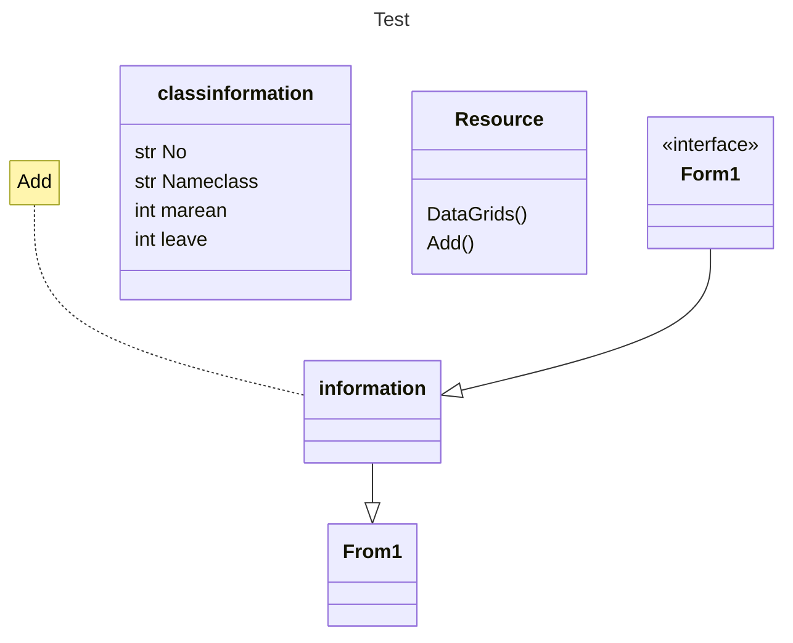

# CheckNamesys
## ความเป็นมา เเละ วัตถุุประสงค์
ความเป็นมา :อยากทำระบบเก็บจำนวนนักศึกษา 
วัตถุประสงค์ :เช็คคนมา  คนลา คนขาด ในวันที่นั้นๆ เเละสามารถเก็บไว้ดูเช็คย้อนหลังได้

##ผู้เขียน
Name : จันทิมา พรมวัง
ID  : 6534560280-1
E-mail :junthima.p@kkumail.com

# classDiagram 

   
